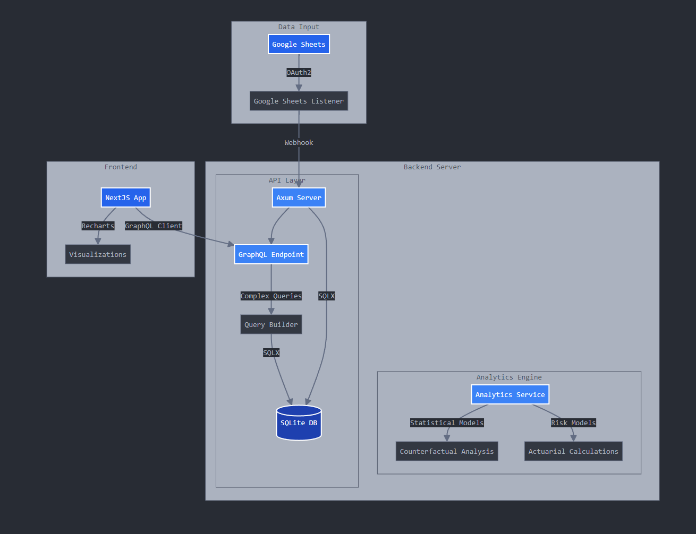

# Rust Dedicated Server

## Overview

A multi-crate Rust workspace built around `file_host`, an Axum service backed
by SQLx repositories, a Redis/NATS JetStream pipeline, and WebSocket
transport. The table below maps each area to where it actually lives in the
tree, so a claim can be checked against code rather than taken on faith.

| Area | What's implemented | Where |
| --- | --- | --- |
| **HTTP API** | Axum routes with a generated, tested route inventory — the declared surface is diffed against the live routers, not just documented | [`apps/servers/file_host/src/routes`](./apps/servers/file_host/src/routes), [route inventory](./apps/servers/file_host/docs/route-inventory.md) |
| **SQLx repositories** | Typed repositories with compile-time-checked queries and paired migrations, one crate per domain (activity, capture, engagement, mood event, presence, push, session) | [`crates/db`](./crates/db), [`migrations`](./migrations) |
| **Redis / NATS pipeline** | Redis caching and in-flight coalescing in front of NATS JetStream jobs, with explicit redelivery semantics on retryable failures | [`crates/some-cache`](./crates/some-cache), [`crates/some-transport`](./crates/some-transport), [`crates/push_kit`](./crates/push_kit) |
| **WebSockets** | Restart-aware connections with heartbeat/staleness detection, broadcast isolation, and bounded shutdown | [`apps/servers/file_host/src/websocket`](./apps/servers/file_host/src/websocket), [`crates/ws-connection`](./crates/ws-connection), [`crates/ws-conn-manager`](./crates/ws-conn-manager) |
| **Overload controls** | Token-bucket rate limiting, load shedding, and timeouts, with rejection tracked as a first-class fault condition rather than inferred from resource pressure | [`apps/servers/file_host/src/rate_limiter`](./apps/servers/file_host/src/rate_limiter), [fault conditions](./docs/fault-conditions.md) |
| **Observability** | Prometheus metrics and dashboards that render missing data as *unknown*, never as healthy by default | [`apps/servers/file_host/src/metrics`](./apps/servers/file_host/src/metrics), [dashboard honesty](./docs/dashboard-honesty.md) |
| **Tests against real dependencies** | Test suites that exercise SQLite, Redis, and NATS directly instead of mocking them away | [`crates/db/activity/tests`](./crates/db/activity/tests), [`crates/ws-connection/tests`](./crates/ws-connection/tests) |

## Status and limitations

No users, no traffic. This is a single-engineer workspace, exercised by its
own test suite and CI rather than by production load — every row above means
"the code demonstrates this," not "this has been operated at scale." See
[`docs/fault-conditions.md`](./docs/fault-conditions.md) for what is
instrumented and what isn't, and [`docs/WARNING.md`](./docs/WARNING.md) for
the standing caveat on trusting any of it blindly.

---

## Requirements
* Rust (latest stable)
* Cargo
* Some database (postgres, mysql, sqlite — or imagination)

**OR** just use Nix:
```bash
nix develop  # Everything you need, deterministically
```

See [Nix Development Environment](./nix/README.md) for details.

---

## Documentation

### Development Environment
* [**Nix Setup & Modules**](./nix/README.md) – Reproducible dev env, ML model management, no cron jobs

### System Architecture

* [System Design Documentation](./docs/system_design)
* [Mermaid Diagram Source](./docs/system-architecture.mermaid)
* [⚠️ Important Warnings](./docs/WARNING.md)

---

### Service Level Agreements
* [WebSocket Service SLA](./apps/servers/file_host/docs/sla/WebsSocket_Service_SLA.md)

---

### API Documentation
* [Google Sheets API Design](./apps/servers/file_host/docs/api/gsheet_api_design.md)

### Models Use Documentation
* [Whisper Model Optimization Guide](./docs/models/whisper-optimization.md)
