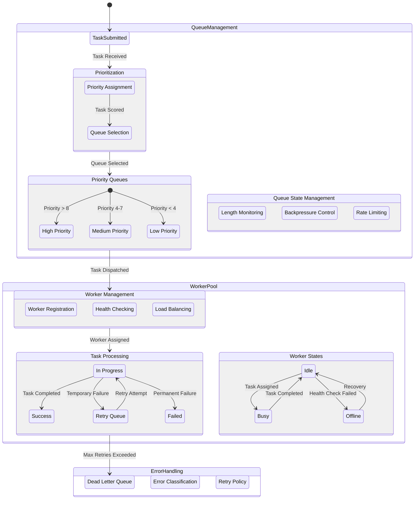

# Workflow Documentation: Task Scheduling and Processing

This README provides an overview of the task scheduling and processing workflow designed to prioritize, manage, and process tasks efficiently within a distributed system. This workflow includes components for queue management, worker pool management, and error handling.

---

## Overview

The workflow consists of three primary modules:
1. **Queue Management**: Prioritizes and manages tasks based on priority levels.
2. **Worker Pool**: Handles task assignment, worker states, and task processing.
3. **Error Handling**: Manages retries, error classification, and dead letter queue (DLQ) management.

## Workflow States

---

### 1. Queue Management

**Task Prioritization and Queue Selection**:  
- Tasks are submitted and initially go through a prioritization process.
- Tasks are assigned a priority score which determines the appropriate queue:
  - High Priority (score > 8)
  - Medium Priority (score 4-7)
  - Low Priority (score < 4)

**Queue State Management**:
- **Length Monitoring**: Monitors the length of queues to optimize throughput.
- **Backpressure Control**: Manages backpressure by adjusting task flow to prevent overwhelming the system.
- **Rate Limiting**: Ensures requests are throttled appropriately to maintain system stability.

**Notes**:
- Consistent hashing is used for queue sharding.
- Lease-based task assignment and atomic operations ensure reliability and data integrity.

### 2. Worker Pool

**Worker Management**:
- **Worker Registration**: New workers register to handle tasks.
- **Health Checking**: Checks worker status to ensure operational reliability.
- **Load Balancing**: Distributes tasks evenly across available workers.

**Task Processing**:
- **In Progress**: Active tasks are tracked until completion.
- **Retry Queue**: Tasks that fail temporarily are added to this queue.
- **Success / Failed**: Final states after completion or max retry attempts.

**Worker States**:
- **Idle**: Worker is available for tasks.
- **Busy**: Worker is actively processing a task.
- **Offline**: Worker has failed a health check; recovery processes attempt to restore availability.

**Notes**:
- Includes handling for graceful shutdown, worker timeout, and concurrent task limits.

### 3. Error Handling

**Error Classification and Retry Policy**:
- **Error Classification**: Classifies errors to determine handling strategies.
- **Retry Policy**: Configures retry limits, exponential backoff, and circuit-breaking measures.
- **Dead Letter Queue (DLQ)**: Collects tasks that exceed retry limits.

**Notes**:
- Supports exponential backoff for retries and error aggregation for monitoring and analysis.

---

### Example Scenario

1. A task is submitted and prioritized.
2. Based on its priority, the task is added to the corresponding queue.
3. A worker is assigned, processes the task, and the system monitors task success/failure.
4. If the task fails, it may be retried or sent to the DLQ based on the retry policy.

---

This system is designed to be non-blocking, distributed, and scalable for robust task scheduling and processing, without relying on commercial third-party solutions.
