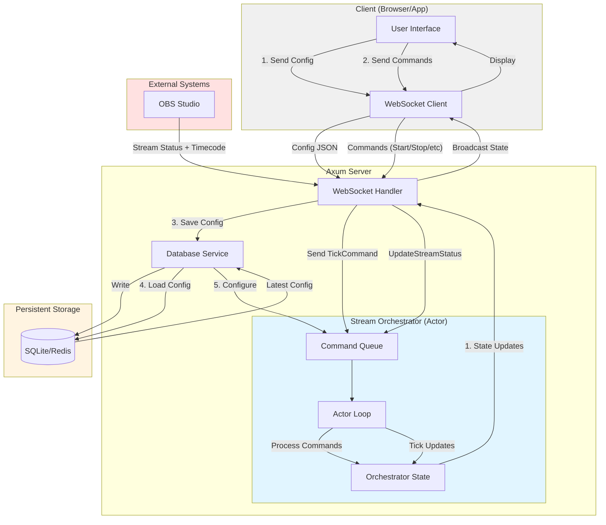
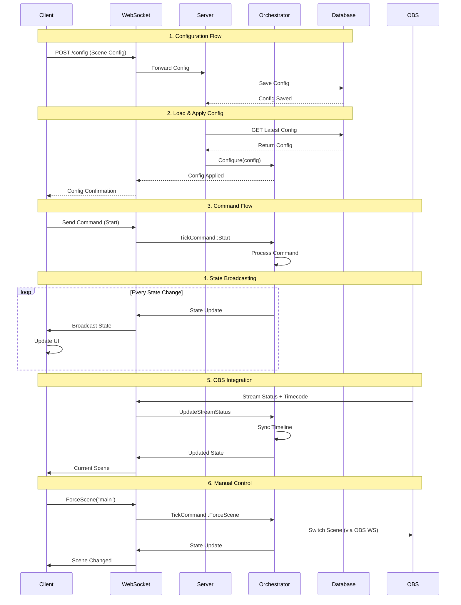

# Stream Orchestrator

scene event thingy for boyo's livestream. 

## Architecture Overview

```mermaid
flowchart TB
    subgraph Client["Client (Browser/App)"]
        UI[User Interface]
        WSClient[WebSocket Client]
    end

    subgraph Server["Axum Server"]
        WSHandler[WebSocket Handler]
        DBService[Database Service]
        
        subgraph Orchestrator["Stream Orchestrator (Actor)"]
            Actor[Actor Loop]
            State[Orchestrator State]
            Commands[Command Queue]
        end
    end

    subgraph Storage["Persistent Storage"]
        DB[(SQLite/Redis)]
    end

    subgraph External["External Systems"]
        OBS[OBS Studio]
    end

    %% Client -> Server flows
    UI -->|"1. Send Config"| WSClient
    WSClient -->|"Config JSON"| WSHandler
    WSHandler -->|"3. Save Config"| DBService
    DBService -->|"Write"| DB

    UI -->|"2. Send Commands"| WSClient
    WSClient -->|"Commands (Start/Stop/etc)"| WSHandler
    WSHandler -->|"Send TickCommand"| Commands

    %% Server internal flows
    Commands --> Actor
    Actor -->|"Process Commands"| State
    Actor -->|"Tick Updates"| State
    
    %% Server -> Database
    DBService -->|"4. Load Config"| DB
    DB -->|"Latest Config"| DBService
    DBService -->|"5. Configure"| Commands

    %% Server -> Client flows
    State -->|"1. State Updates"| WSHandler
    WSHandler -->|"Broadcast State"| WSClient
    WSClient -->|"Display"| UI

    %% OBS Integration
    OBS -->|"Stream Status + Timecode"| WSHandler
    WSHandler -->|"UpdateStreamStatus"| Commands

    style Orchestrator fill:#e1f5ff
    style Client fill:#f0f0f0
    style Storage fill:#fff4e1
    style External fill:#ffe1e1
```

## Data Flow Cycle

### Complete Orchestration Cycle

```mermaid
sequenceDiagram
    participant Client
    participant WebSocket
    participant Server
    participant Orchestrator
    participant Database
    participant OBS

    Note over Client,Database: 1. Configuration Flow
    Client->>WebSocket: POST /config (Scene Config)
    WebSocket->>Server: Forward Config
    Server->>Database: Save Config
    Database-->>Server: Config Saved
    
    Note over Client,Database: 2. Load & Apply Config
    Server->>Database: GET Latest Config
    Database-->>Server: Return Config
    Server->>Orchestrator: Configure(config)
    Orchestrator-->>WebSocket: Config Applied
    WebSocket-->>Client: Config Confirmation

    Note over Client,OBS: 3. Command Flow
    Client->>WebSocket: Send Command (Start)
    WebSocket->>Orchestrator: TickCommand::Start
    Orchestrator->>Orchestrator: Process Command
    
    Note over Client,OBS: 4. State Broadcasting
    loop Every State Change
        Orchestrator->>WebSocket: State Update
        WebSocket->>Client: Broadcast State
        Client->>Client: Update UI
    end

    Note over Client,OBS: 5. OBS Integration
    OBS->>WebSocket: Stream Status + Timecode
    WebSocket->>Orchestrator: UpdateStreamStatus
    Orchestrator->>Orchestrator: Sync Timeline
    Orchestrator->>WebSocket: Updated State
    WebSocket->>Client: Current Scene
    
    Note over Client,OBS: 6. Manual Control
    Client->>WebSocket: ForceScene("main")
    WebSocket->>Orchestrator: TickCommand::ForceScene
    Orchestrator->>OBS: Switch Scene (via OBS WS)
    Orchestrator->>WebSocket: State Update
    WebSocket->>Client: Scene Changed
```

