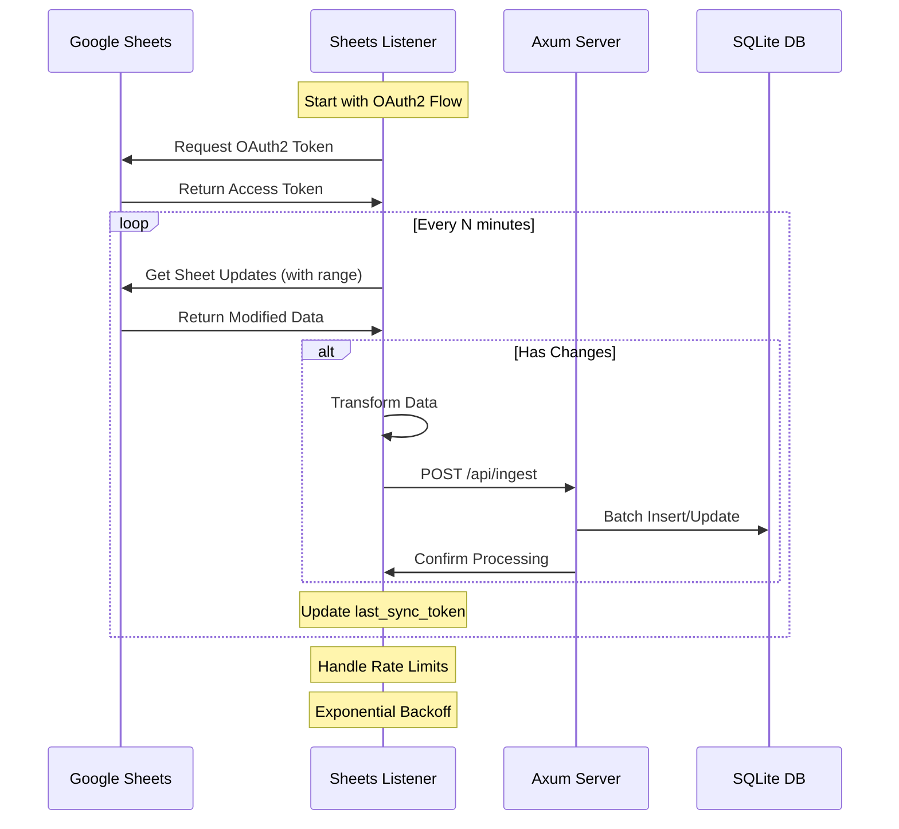
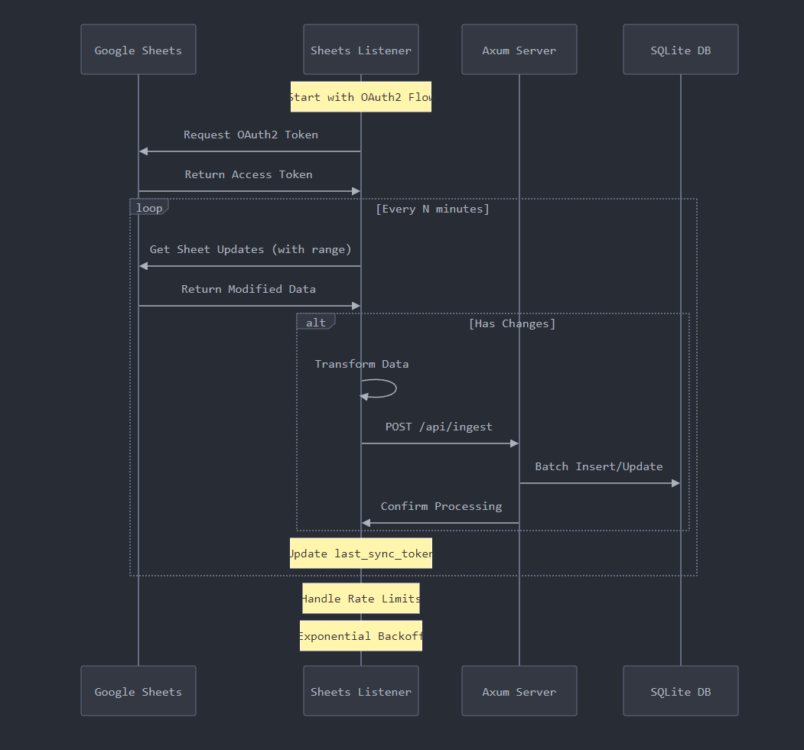

## Architecture

The architecture consists of the following components:

- **Google Sheets**: Serves as the primary data input source for play-by-play data.
- **Sheets Listener**: Listens for updates in the Google Sheets and manages data synchronization.
- **Axum Server**: Acts as the backend server, processing incoming data and providing a GraphQL endpoint.
- **SQLite Database**: Stores the processed play-by-play data for querying and analysis.

## Data Flow

1. **OAuth2 Authentication**: The Sheets Listener initiates the OAuth2 flow to obtain an access token for Google Sheets.
2. **Data Sync Loop**:
    - Every N minutes, the Sheets Listener retrieves updates from the specified range in Google Sheets.
    - If there are changes, the Listener transforms the data and sends a POST request to the Axum server.
    - The Axum server processes the incoming data and updates the SQLite database accordingly.
3. **Rate Limiting**: The Sheets Listener handles rate limits imposed by the Google Sheets API using an exponential backoff strategy.

## Features

- **Data Ingestion**: Automatic synchronization of updates from Google Sheets to the SQLite database.
- **GraphQL API**: Provides a flexible interface for frontend applications to query complex data.
- **Analytics**: Enable statistical and actuarial analyses on the NFL play-by-play data.

